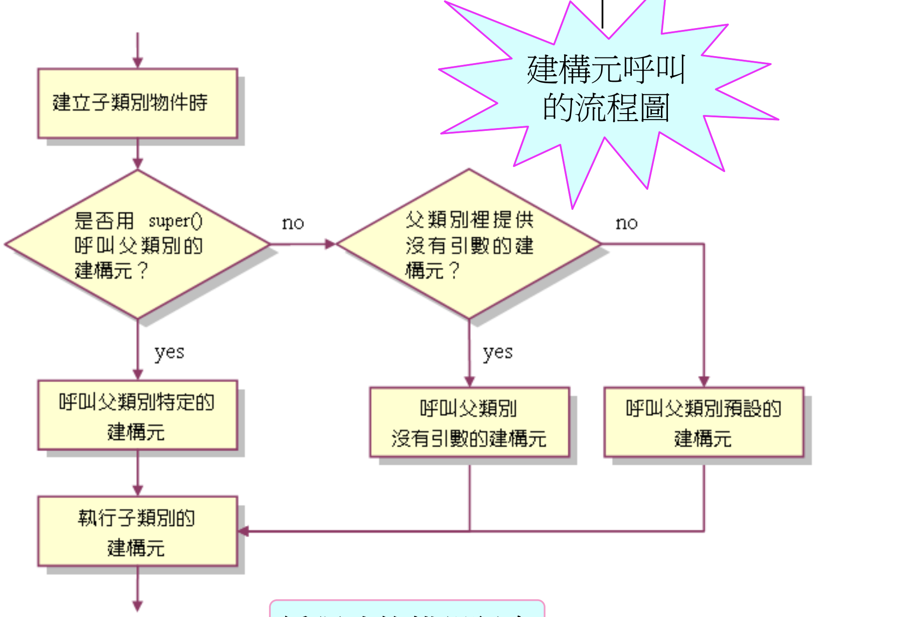

# [JAVA 基本] 類別繼承 ch03

## 類別繼承
### 基本概念
程式可以藉由繼承的概念，保存原本的功能，並加以擴展，而且讓原本的程式碼可以繼續使用，不需要重複撰寫。  
父類別不能動子類別項目。子類別可以動父類別項目。
#### 既有類別：稱作父類別 or 基底類別
#### 衍生類別：子類別 or 衍生類別
#### 每一個子類別，只可以有一個父類別。一個類別可以有多個子類別
#### 可繼承的項目：
  * #### 沒有宣告成public or private的成員
  * #### public 成員
  * #### protected 成員
  * #### private 成員（無法繼承）（擁有，但一樣要透過父類別存取）
  * #### 建構元（無法繼承）
  * #### 終止繼承的成員（無法繼承）

### 程式操作
```java
class 父類別名稱 {
  // 父類別的成員
}

class 子類別名稱 extends 父類別名稱 {
  // 子類別成員
}

class Circle {
  private static double pi = 3.14;
  public void setRadius(double r){
    radius = r;
    System.out.println("radius"+radius);
  }
  public void show(){
    System.out.println("area"+pi*radius*radius)
  }
}

class Coin extends Circle {
  private int value;
  public Coin(){
    System.out.println('Coin start');
  }
  public void setValue(int t){
    value = t;
    System.out.println('value'+value)
  }
}

public class app_10_1{
  public static void main(String args[]){
    Coin coin = new Coin()
    coin.setRadius(1.0)
    coin.show() // 使用父類別的function
  }
}
```

### 生命週期
* 父類別建構元執行完之後，才會執行子類別的建構元

### 呼叫父類別的特定建構元
* #### 使用super()
```java
class Circle {
  public Circle(){
    System.out.println('constructor1 call')
  }

  public Circle(double r){
    System.out.println('constructor2 call')
  }
}

class Coin extends Circle {
  public Coin(double r, int v){
    super(r); // 當new 出一個coin時，Circle建構子有引數的會被執行！
    value = v;
    System.out.println('Coin constructor call')
  }
}
```



### this vs super
#### 不同之處
* ##### this() 在同一類別，呼叫其他建構元
* ##### super() 從子類別呼叫其父類別的建構元
#### 相同之處
* ##### 有多載時，this() / super()會根據給予的引數型態與個數，正確執行相對應的建構元
* ##### 都必須寫在建構元的第一行，也因此無法同存

#### 存取方式
* super.資料成員名稱 / super.函數名稱

#### 特性
* this：可以存取本身類別的成員、函數、建構子
* super：可以存取父類別的資料成員、函數成員、建構子（所以必定繼承時才會出現）（並且父成員、函數不得為private）

## 保護成員
相較於過去的`private`，只能在父類別使用。`protect`可以讓變數開放權限，也給子類別使用
* ##### protect 於父類別、子類別中，又不讓外部讀取
```java
class Circle {
  protected static double pi = 3.14;
  protected double radius;
}

class Coin extends Circle {
  public Coin(double r, int v){
    radius = r; // 這邊子類別可以直接存取父類別的value
    value = v
  }
}
```

## 多型
* ##### 藉由改寫達到多型
```java
class Circle {
  public void show(){
    System.out.println('print father show')
  }
}

class Coin extends Circle {
  public void show(){
    System.out.println('print child show')
  }
}

public class app10_6 {
  public static void main(String args[]){
    Coin coin = new Coin()
    coin.show() // print child show -> 因為 show 被覆寫了
  }
}
```
### 多載與改寫
* #### 多載：相同類別內，定義名稱相同、但引數個數或型態不同的函數。
* #### 改寫：在子類別中，定義名稱、引數個數與傳回值的型態均與父類別相同的函數
* #### 父類別與子類別的名稱、引數個數、型態要完全相同，才可以透過父類別的變數呼叫子類別的函數
### 建立時的不同
```java
// 考慮 1.
Circle coin = new Coin(2.0, 5)
coin.show() // 一樣是do 子類別的show

// 考慮 2. 
Coin coin = new Circle() // 錯誤，子類別的變數，無法指派給父類別的物件
```

## is-a & has-a

### is-a
代表繼承的概念。A類別繼承了B類別。A is-a B


### has-a
代表擁有的概念。A類別裡宣告了B類別。A has-a B

## 終止繼承
* 使用 final 關鍵字
  * 特性：經過宣告後，不得被改寫 or 繼承
```java
class Caaa {
  public final void show(){
    System.out.println('stop extends')
  }
}

class Cbbb extends Caaa {
  public void show(){
    System.out.println() // 報錯，因為Caaa的show已經定義final無法繼承。
  }
}

```

## 萬物之源 - Object 類
萬物之源
```java
class Circle {
  // 上面看似沒有繼承自任一個類別，但是實際上是繼承自object類別
}
```
### getClass()函數：知道變數是什麼Class
```java
// demo：getClass()函數
public class app10_11 {
  public static void main(String args[]){
    Caaa a = new Caaa(5);
    Class ca = a.getClass();  // 取得a的Class
  }
}
```

### equals()
```java
public class app10_12 {
  public static void main(String args[]){
    Caaa a = new Caaa(5)
    Caaa b = new Caaa(5)
    Caaa c = a;
    boolean br1 = a.equals(b) // false
    boolean br2 = a.equals(c) // true
  }
}
```
### toString()
一般如果要轉換成String，會改寫object中原本的toString()函數
```java
class Caaa {
  public String toString(){
    String str = "toString() called, num"+num;
    return str
  }
}

```

